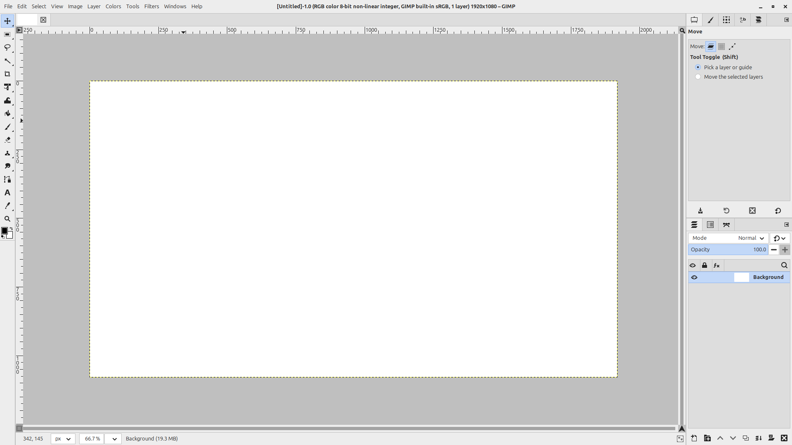
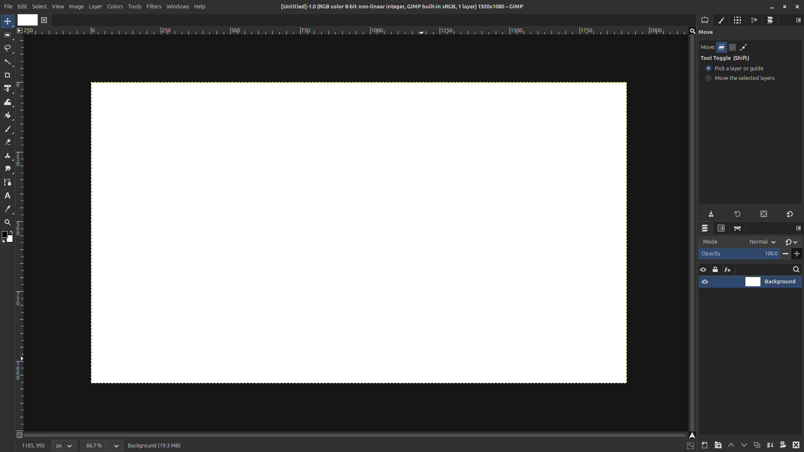
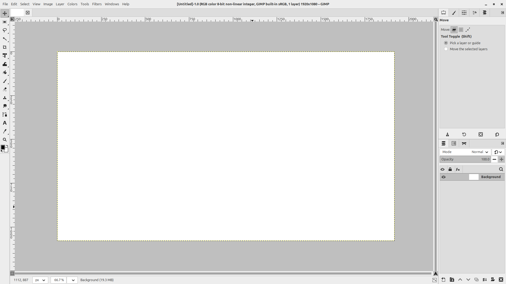
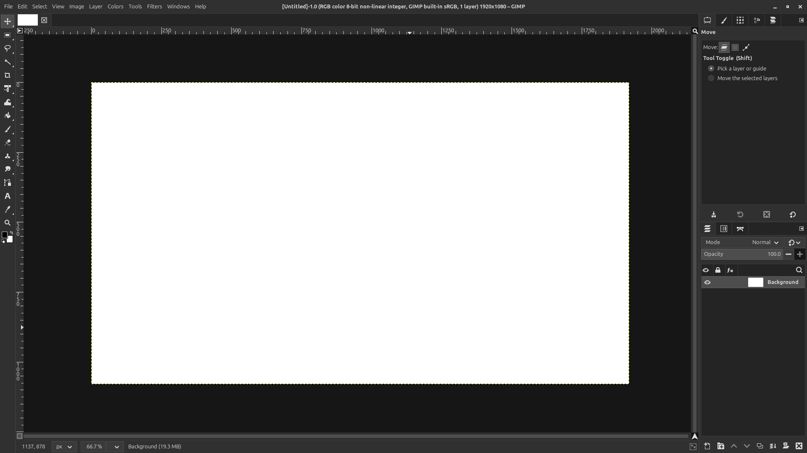
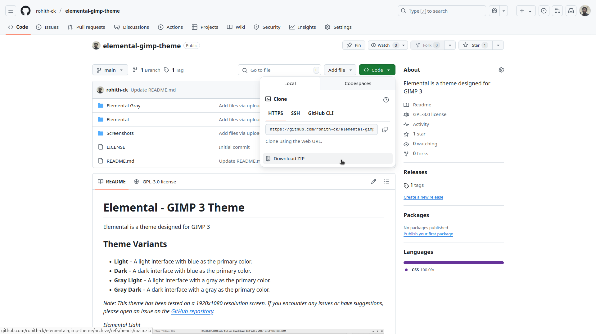
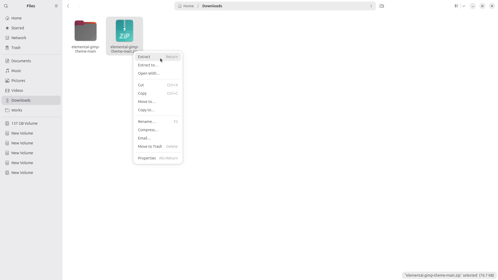
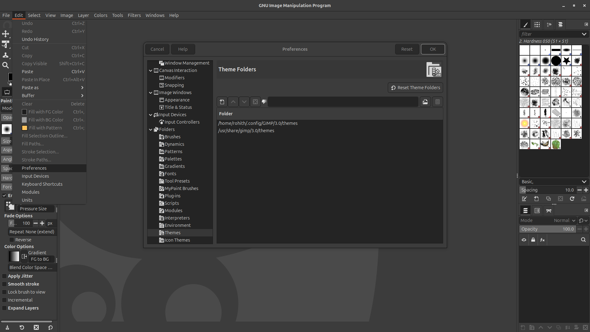

# Elemental - GIMP 3 Theme

Elemental is a theme designed for GIMP 3

## Theme Variants

- **Light** – A light interface with blue as the primary color.
- **Dark** – A dark interface with blue as the primary color.
- **Gray Light** – A light interface with a gray as the primary color.
- **Gray Dark** – A dark interface with a gray as the primary color.

_Note: This theme has been tested on a 1920x1080 resolution screen.
      If you encounter any issues or have suggestions, please open an issue on the [GitHub repository](https://github.com/rohith-ck/elemental-gimp-theme)._

_Elemental Light_

_Elemental Dark_

_Elemental Gray Light_

_Elemental Gray Dark_

## Installation Guide

Follow these steps to install the **Elemental** theme for GIMP 3:

### Step 1: Download the Theme Folder
Download the **Elemental** theme folder from the repository.

### Step 2: Extract the Theme Folder
Extract the downloaded theme folder to a location of your choice on your computer.

### Step 3: Add the Folder to GIMP's Theme Folders List
1. Open GIMP.
2. Navigate to **Edit > Preferences > Folders > Themes**.
3. Add extracted folder to Theme Folders list.
4. Restart GIMP.

### Step 4: Apply the Theme in GIMP Preferences
1. Open GIMP.
2. Navigate to **Edit > Preferences > Theme**.
3. Select **Elemental** from the list of available themes.
4. Use the **Color scheme variant** list to switch between Light and Dark modes.

